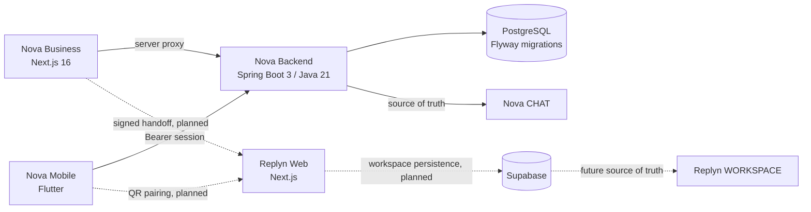

# Nova - Mạng kết nối công việc cho Business và Freelancer

> Nova giúp hai bên tìm thấy nhau. Replyn giúp hai bên tin nhau để làm việc.

Nova là hệ sinh thái kết nối doanh nghiệp quốc tế với freelancer Việt Nam, từ lúc khám phá năng lực, đăng việc,
ứng tuyển và trao đổi, cho đến khi hai bên chuyển sang một quy trình làm việc có thỏa thuận, giai đoạn, sản phẩm
bàn giao và bằng chứng rõ ràng.

Repo này là **repo đại diện của bài nộp Nova**. Nó chứa Nova Business Web và shared backend Spring Boot/PostgreSQL.
Hai giao diện còn lại được phát triển trong các repo riêng và được mô tả đầy đủ bên dưới:

| Thành phần | Vai trò | Repository | Trạng thái |
| --- | --- | --- | --- |
| **Nova Business** | Cổng thông tin và vận hành cho doanh nghiệp | Repo hiện tại | Demo web + kết nối shared backend |
| **Nova Mobile** | Ứng dụng Flutter cho freelancer | [NIVEX-FLUTTER](https://github.com/giahuydoo0207-tech/NIVEX-FLUTTER) | Mobile demo; auth và một số luồng dữ liệu dùng backend thật |
| **Replyn** | Không gian bảo vệ quá trình thực hiện công việc | [replyn-web](https://github.com/giahuydoo0207-tech/replyn-web) | Frontend prototype; workflow tài chính đang mô phỏng |

Tên repository vẫn là `NIVEX-BUSINESS` trong quá trình chuyển thương hiệu từ NIVEX sang Nova.

## Thử nghiệm sản phẩm

- [Nova Business Web](https://nivex-business.vercel.app)
- [Replyn Web](https://replyn-web.vercel.app)
- Nova Mobile được build thành APK từ repo `NIVEX-FLUTTER`.

## Bài toán

Quá trình thuê freelancer thường bị đứt gãy thành nhiều mảnh:

- Doanh nghiệp đăng tin, đăng việc và tìm ứng viên ở một nơi.
- Freelancer xây hồ sơ, portfolio và ứng tuyển ở một nơi khác.
- Hai bên chốt phạm vi, deadline và sản phẩm bàn giao trong tin nhắn rồi tự theo dõi bằng cách thủ công.
- Khi có bất đồng, bằng chứng bị phân tán giữa chat, file và các phiên bản sản phẩm.

Nova gom hành trình đó thành một dòng liên tục:

1. **Discover:** Business đăng cơ hội; Freelancer xây hồ sơ, danh tiếng và portfolio.
2. **Match:** Hai bên ứng tuyển, đánh giá tín hiệu và trao đổi trong cùng Nova thread.
3. **Agree:** Khi công việc đã có giá trị, deadline và bàn giao, Nova tạo handoff sang Replyn.
4. **Deliver:** Replyn theo dõi thỏa thuận, milestone, phiên bản file, nghiệm thu và bằng chứng.
5. **Resolve:** Nếu phát sinh bất đồng, dữ liệu liên quan được đóng gói thành hồ sơ để đội ngũ Nova xem xét.

## Một sản phẩm, ba trải nghiệm

### Nova Business

Nova Business đại diện cho phía doanh nghiệp:

- Quản lý hồ sơ tổ chức và nội dung doanh nghiệp.
- Đăng việc, quản lý trạng thái và danh sách ứng viên.
- Xem hồ sơ, portfolio và các tín hiệu sẵn sàng của freelancer.
- Trao đổi với ứng viên trong message thread dùng chung với Nova Mobile.
- Tạo invoice, payment request và theo dõi các trạng thái thanh toán demo.
- Đi qua server-side proxy khi truy cập shared backend, không đưa demo API key ra trình duyệt.

**Giới hạn hiện tại:** Business Web chưa có tài khoản thành viên doanh nghiệp thật. Form đăng nhập đang là demo và
backend đang vận hành dưới một organization mẫu. Đây không phải production authentication.

### Nova Mobile

Nova Mobile đại diện cho phía freelancer:

- Đăng ký và đăng nhập bằng email, mật khẩu.
- Lưu access/refresh session trong secure storage và hỗ trợ khóa sinh trắc học.
- Xây hồ sơ nghề nghiệp, kỹ năng, reputation và portfolio.
- Đăng bài cá nhân hoặc sản phẩm; tương tác trong community feed.
- Tìm việc, lưu việc, ứng tuyển và trao đổi với doanh nghiệp.
- Xem invoice, wallet và payment state trong phạm vi demo.

Nova Mobile và Nova Business dùng chung Spring Boot API, PostgreSQL và `message_threads.id`. Hai giao diện hiện
đang polling dữ liệu; realtime và push notification chưa phải phạm vi của bản nộp này.

### Replyn

Replyn là lớp bảo vệ công việc được mở sau khi hai bên đã chọn nhau:

- Một cuộc trò chuyện với hai view: `CHAT` và `WORKSPACE`.
- Đề xuất công việc và thỏa thuận có version.
- Milestone, cấp vốn mô phỏng, bắt đầu thực hiện, nộp sản phẩm và nghiệm thu.
- File có version và SHA-256 tính trên trình duyệt.
- Nhật ký bằng chứng và luồng yêu cầu hỗ trợ/tranh chấp.
- Phí, ký quỹ và giải ngân luôn được ghi rõ là **mô phỏng**.

Màn `Tiếp tục với Nova` (`/auth/nova`) gồm Nova ID/Nova Key và QR hiện là **prototype frontend**. Signed handoff,
QR pairing và Supabase integration đã có ERD/contract trong repo Replyn nhưng chưa được triển khai vào bản nộp.

## Hành trình demo

1. Business tạo job và xem danh sách ứng viên trên Nova Business.
2. Freelancer tìm job, nộp hồ sơ và theo dõi trạng thái trên Nova Mobile.
3. Hai bên trao đổi trong cùng một Nova message thread.
4. Business chọn ứng viên; giao diện đề xuất chuyển công việc sang Replyn.
5. Replyn mở đúng cuộc trò chuyện, không yêu cầu tìm lại tài khoản đối tác.
6. Hai bên khóa thỏa thuận, làm theo milestone, nộp file và nghiệm thu.
7. Nếu có bất đồng, Replyn tập hợp bằng chứng và mở luồng hỗ trợ của Nova.

Trong bản nộp hiện tại, bước chuyển Nova -> Replyn và đăng nhập QR là prototype UI; dữ liệu Replyn là seed/mock.
README không tuyên bố đây là SSO hay backend production.

## Kiến trúc tổng thể



### Ranh giới dữ liệu đã chốt

- **Nova backend** là source of truth cho tài khoản Nova, jobs, applications và `CHAT`.
- **Replyn/Supabase** sẽ là source of truth cho `WORKSPACE`, milestone, evidence và dispute.
- Replyn không sao chép toàn bộ lịch sử Nova CHAT. Tin chat được chọn làm bằng chứng sẽ được snapshot riêng.
- Nova thread được ánh xạ 1:1 sang Replyn conversation bằng `message_threads.id`.
- Business dùng `organizations.id`; Freelancer dùng `contractor_id` làm external identity nội bộ.
- Nova ID hiển thị công khai không phải mật khẩu và không đủ để đăng nhập.

## Shared backend trong repo này

`backend/` là API dùng chung cho Nova Business và Nova Mobile:

- Spring Boot 3.4, Java 21.
- PostgreSQL 16 và Flyway migrations.
- Mobile authentication, refresh-token rotation và session hashing.
- Organizations, profiles, community, jobs, applications, messaging, notifications, invoices và payment demo.
- Nova Business truy cập qua `/api/devnet/*` proxy phía server.
- Nova Mobile truy cập trực tiếp bằng Bearer token.

Tài liệu liên quan:

- [Backend README](backend/README.md)
- [ERD](docs/backend/erd.md)
- [API contract](docs/backend/api-contract.md)
- [Demo deployment](docs/DEPLOY-DEMO.md)
- [Security/backend audit](docs/AUDIT-2026-09-28.md)

## Trạng thái tại bản nộp

| Hạng mục | Đã hoàn thành | Đang mô phỏng / tiếp theo |
| --- | --- | --- |
| Business Web | Dashboard, organization, community, jobs, candidates, messages, invoices/payment UI | Business-member authentication |
| Mobile | Auth, profile, feed, jobs, applications, messages, wallet/invoice UI | QR scanner, deep link, push/realtime |
| Shared backend | PostgreSQL/Flyway, mobile auth, jobs, applications, messages, notifications, payment demo | Production identity/authorization hardening |
| Replyn | Chat/workspace UI, milestone, file, evidence, dispute demo, Nova login prototype | Supabase persistence, signed handoff, QR pairing |
| Payments | Devnet/demo states and transaction verification experiments | Custody, Mainnet, bank payout, production compliance |

## Tiến độ hackathon

Trong đợt hoàn thiện bản demo, team đã:

- Hoàn chỉnh hai mặt trải nghiệm Business Web và Freelancer Mobile quanh một shared backend.
- Đồng bộ jobs, applications và message thread giữa hai phía.
- Xây dựng Replyn để mở rộng câu chuyện từ "tìm thấy nhau" sang "làm việc có bảo vệ".
- Tách CHAT khỏi các cơ chế nghiệp vụ để giao diện gọn và dễ trình bày.
- Hoàn thiện luồng demo milestone, file version, evidence và dispute.
- Thiết kế prototype đăng nhập Replyn bằng Nova ID/QR.
- Khảo sát code thật của cả ba thành phần và chốt ERD/integration contract cho giai đoạn Supabase tiếp theo.
- Bổ sung test cho business logic, frontend build và các luồng demo chính.

## Cấu trúc repository

```text
app/          Nova Business routes và server-side API proxy
components/   Business UI, messages, jobs, profiles, invoices
lib/          Contracts, state machines, API clients, business rules
backend/      Shared Spring Boot API và Flyway migrations
docs/         ERD, API contracts, audit và hướng dẫn deploy demo
scripts/      Seed và demo utilities
```

## Công nghệ

**Nova Business**

- Next.js 16, React 19, TypeScript
- Tailwind CSS, Radix UI, TanStack Table, Lucide

**Shared backend**

- Java 21, Spring Boot 3.4
- PostgreSQL 16, Flyway
- Docker Compose

**Companion applications**

- Nova Mobile: Flutter / Dart
- Replyn: Next.js / React / TypeScript

## Chạy Nova Business

```bash
git clone https://github.com/giahuydoo0207-tech/NIVEX-BUSINESS.git
cd NIVEX-BUSINESS
npm install
npm run dev
```

Mở `http://localhost:3000`.

Kiểm tra frontend:

```bash
npm run lint
npm test
npm run build
```

## Chạy shared backend

Cách ngắn nhất để chạy PostgreSQL và API:

```bash
docker compose up --build
```

API health check: `http://localhost:8080/api/v1/health`.

Xem [backend/README.md](backend/README.md) nếu cần chạy Maven trực tiếp hoặc cấu hình database riêng.

## Chạy Nova Mobile

```bash
git clone https://github.com/giahuydoo0207-tech/NIVEX-FLUTTER.git
cd NIVEX-FLUTTER
flutter pub get
flutter analyze
flutter test
flutter run
```

Để APK dùng shared backend, truyền `NOVA_API_URL` bằng `--dart-define`; xem [hướng dẫn deploy demo](docs/DEPLOY-DEMO.md).

## Chạy Replyn

```bash
git clone https://github.com/giahuydoo0207-tech/replyn-web.git
cd replyn-web
npm install
npm run dev
```

Replyn trong bản nộp mặc định dùng reducer mock để đảm bảo demo ổn định. Mọi dòng tiền, phí và giải ngân đều là mô phỏng.

## An toàn và tính trung thực

- Nova Business chưa có production authentication; demo công khai cần Deployment Protection.
- Không đưa `NOVA_DEMO_API_KEY`, database credential, private key hoặc service-role key vào frontend/Git.
- Không dùng Nova ID công khai làm credential.
- Không coi demo invoice, wallet balance, ký quỹ hoặc payout là giao dịch tài chính thật.
- Không custody tài sản và không xử lý bank payout trong bản prototype.
- Signed handoff, QR pairing và Supabase được ghi rõ là kế hoạch, không phải tính năng đã production hóa.

## Lộ trình tiếp theo

1. Thêm Business member identity và session thật.
2. Ký handoff Nova -> Replyn bằng token ngắn hạn, dùng một lần.
3. Ánh xạ Nova identity/thread sang Replyn conversation.
4. Thêm Supabase persistence và RLS cho Replyn WORKSPACE.
5. Thêm QR pairing trên Nova Mobile.
6. Xây Nova CHAT connector có service credential và audit rõ ràng.
7. Hoàn thiện realtime, device management và production security review.

## Tác giả

Nova được phát triển bởi [Gia Huy Do](https://github.com/giahuydoo0207-tech) cho bản demo hackathon 2026.
