# Nova Core ERD

```mermaid
erDiagram
  USERS ||--o{ ORGANIZATION_MEMBERS : joins
  ORGANIZATIONS ||--o{ ORGANIZATION_MEMBERS : has
  USERS ||--o| FREELANCER_PROFILES : owns
  USERS ||--o| BUSINESS_PROFILES : owns
  ORGANIZATIONS ||--o{ JOBS : publishes
  JOBS ||--o{ APPLICATIONS : receives
  USERS ||--o{ APPLICATIONS : submits
  ORGANIZATIONS ||--o{ POSTS : publishes
  USERS ||--o{ POSTS : authors
  POSTS ||--o{ POST_MEDIA : contains
  POSTS ||--o{ POST_COMMENTS : has
  POSTS ||--o{ POST_REACTIONS : receives
  USERS ||--o{ POST_COMMENTS : writes
  USERS ||--o{ POST_REACTIONS : makes
  USERS ||--o{ CONVERSATION_MEMBERS : participates
  CONVERSATIONS ||--o{ CONVERSATION_MEMBERS : has
  CONVERSATIONS ||--o{ MESSAGES : contains
  USERS ||--o{ MESSAGES : sends
  ORGANIZATIONS ||--o{ INVOICES : issues
  USERS ||--o{ INVOICES : receives
  INVOICES ||--o| PAYMENT_REQUESTS : creates
  USERS ||--o{ THEME_PREFERENCES : chooses
  USERS ||--o{ AUDIT_EVENTS : causes

  USERS {
    uuid id PK
    text email UK
    text display_name
    text role
    timestamptz created_at
  }
  ORGANIZATIONS {
    uuid id PK
    text legal_name
    text trading_name
    text handle UK
    text verification_status
    text network
    timestamptz created_at
  }
  ORGANIZATION_MEMBERS {
    uuid organization_id FK
    uuid user_id FK
    text role
    timestamptz created_at
  }
  FREELANCER_PROFILES {
    uuid user_id PK,FK
    text headline
    text location
    text bio
    jsonb skills
  }
  BUSINESS_PROFILES {
    uuid organization_id PK,FK
    text headline
    text bio
  }
  JOBS {
    uuid id PK
    uuid organization_id FK
    text title
    text status
    text budget_min_minor
    text budget_max_minor
    text currency
    date application_deadline
  }
  APPLICATIONS {
    uuid id PK
    uuid job_id FK
    uuid applicant_user_id FK
    text status
    integer match_score
    timestamptz submitted_at
  }
  POSTS {
    uuid id PK
    uuid author_user_id FK
    uuid organization_id FK
    text content
    jsonb topics
    timestamptz created_at
  }
  POST_MEDIA {
    uuid id PK
    uuid post_id FK
    text url
    integer sort_order
  }
  POST_COMMENTS {
    uuid id PK
    uuid post_id FK
    uuid author_user_id FK
    uuid parent_id FK
    text content
    timestamptz created_at
  }
  POST_REACTIONS {
    uuid post_id FK
    uuid user_id FK
    text type
    timestamptz created_at
  }
  CONVERSATIONS {
    uuid id PK
    text subject
    timestamptz created_at
  }
  CONVERSATION_MEMBERS {
    uuid conversation_id FK
    uuid user_id FK
  }
  MESSAGES {
    uuid id PK
    uuid conversation_id FK
    uuid sender_user_id FK
    text body
    text delivery_status
    timestamptz sent_at
  }
  INVOICES {
    uuid id PK
    uuid organization_id FK
    uuid contractor_user_id FK
    text invoice_number UK
    text amount_minor
    text currency
    date due_date
    text status
  }
  PAYMENT_REQUESTS {
    uuid id PK
    uuid invoice_id FK
    text network
    text status
    text recipient_address
  }
  THEME_PREFERENCES {
    uuid user_id PK,FK
    text theme_id
    text mode
    timestamptz synced_at
  }
  AUDIT_EVENTS {
    uuid id PK
    uuid actor_user_id FK
    text event_type
    text entity_type
    uuid entity_id
    jsonb payload
    timestamptz created_at
  }
```

Money is stored as decimal strings in minor units to preserve the existing `MinorAmount` and
`AppInvoiceContract` behavior. Every aggregate has an owner boundary: organization-owned
records require membership authorization; freelancer-owned records require the authenticated
user. `PAYMENT_REQUESTS` is deliberately a payment intent record, not a wallet or custody table.
