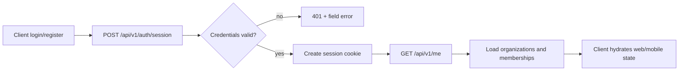
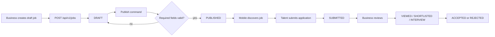
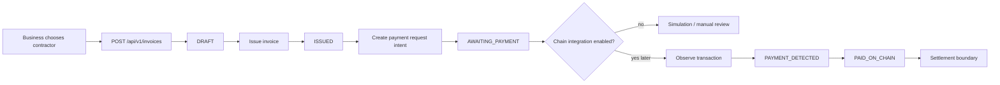
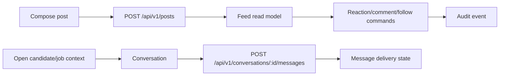

# Nova Backend Flows

## Shared session and workspace flow

## Job-to-application flow

## Invoice-to-payment-preview flow

## Community and messaging flow

The first backend slice should implement session, organizations, jobs and invoices with strict
authorization. Community and messaging can follow once the identity boundary is real.
